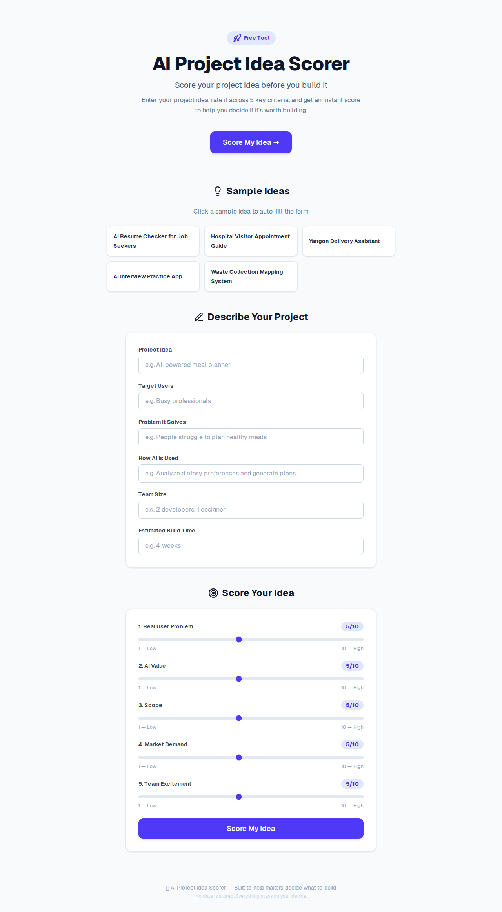

<!--
  Marp template — "editorial-light"
  Render:  marp slides/product-intro.md -o slides/product-intro.html   (or .pdf / .png)
-->
---
marp: true
paginate: true
size: 16:9
---

<style>
@import url('https://fonts.googleapis.com/css2?family=Source+Serif+4:opsz,wght@8..60,400;8..60,600;8..60,700&family=Inter:wght@400;500;700&display=swap');
:root { --bg:#fbfaf7; --ink:#1a1a1a; --muted:#6b6b6b; --accent:#4338ca; --line:#e7e3da; --code:#f3f0e9; }
section {
  background:var(--bg); color:var(--ink);
  font-family:'Inter','Noto Sans','Pyidaungsu',sans-serif;
  font-size:27px; line-height:1.55; padding:60px 80px;
}
h1,h2,h3 { font-family:'Source Serif 4',Georgia,serif; }
h1 { color:#16161a; font-weight:700; border-bottom:2px solid var(--line); padding-bottom:.2em; }
h2 { color:var(--accent); font-weight:600; }
h3 { color:#16161a; }
strong { color:var(--accent); }
a { color:var(--accent); text-decoration:underline; text-underline-offset:3px; }
code { background:var(--code); color:#9a3412; padding:.06em .35em; border-radius:4px; font-family:ui-monospace,monospace; }
pre  { background:#1f1d1a; border-radius:8px; }
pre code { background:none; color:#f4efe7; }
blockquote { border-left:3px solid var(--accent); background:#f5f3ef; color:var(--muted); padding:.5em 1em; font-style:italic; }
table th { background:#f3f0e9; color:var(--accent); }
table td, table th { border-color:var(--line); }
header,footer,section::after { color:var(--muted); font-size:.5em; }
section.cover { background:var(--bg); }
section.cover h1 { border-bottom:none; font-size:2.4em; line-height:1.1; }
section.cover h2 { color:var(--muted); font-weight:400; font-family:'Inter',sans-serif; }
section.lead { background:#f5f3ef; }
section.lead h1 { border-bottom:none; }
</style>

<!-- _class: cover -->

# AI Project Idea Scorer

## Score your startup idea in 60 seconds — before you build

**Free Tool** · zero signup · client-side only

---

# What

- **Score your project idea** across 5 key criteria
- **Problem:** Makers waste months building ideas nobody wants — no quick, structured way to stress-test an idea before coding
- **One thing it nails:** instant, no-friction idea validation — open a URL, answer 5 questions, get a score

---

# Key Features

| | |
|---|---|
| **5-criteria scoring** | Real User Problem · AI Value · Scope · Market Demand · Team Excitement |
| **MVP suggestion** | Actionable next step based on your score |
| **Risk warning** | Flags what could go wrong before you invest |
| **Sample ideas** | Pre-filled examples to see the tool in action |
| **Client-only** | No backend, no API keys, no data leaves your browser |

---

# Zero Dependencies

```bash
npx create-next-app@latest
npm install   # tailwind + react are build deps
npm run dev
```

- **No database** — state lives in React `useState`
- **No API** — scoring logic is pure functions
- **No auth** — it's a static site on Vercel

---

<!-- _class: lead -->

# Live Demo

**https://ai-project-idea-scorer.vercel.app/**



---

# Tech

- **Next.js** 15 (App Router)
- **TypeScript** — strict, zero `any`
- **Tailwind CSS** — utility-first, responsive
- **Vercel** — auto-deploy from `main`

Built with **Claude Code** · 100% AI-generated

---

# Links

- **Live:** https://ai-project-idea-scorer.vercel.app/
- **Repo:** github.com/vibecode/Project-Idea-Scorer
- **License:** MIT
- **Slides:** rendered with [Marp](https://marp.app/)
